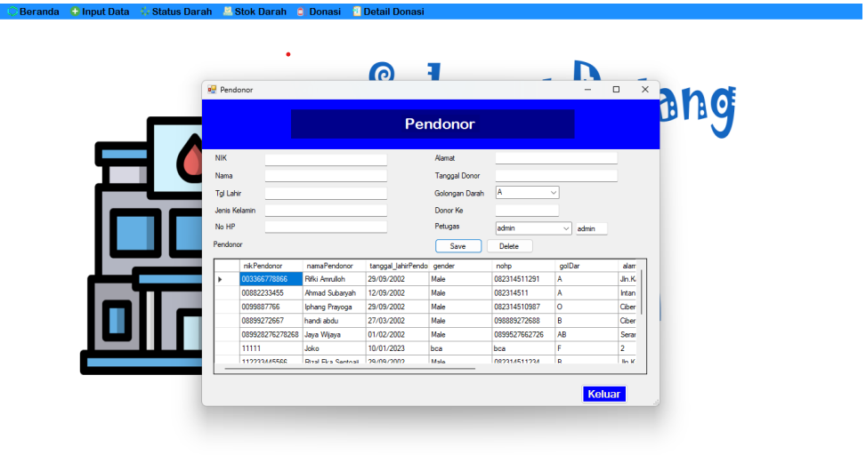
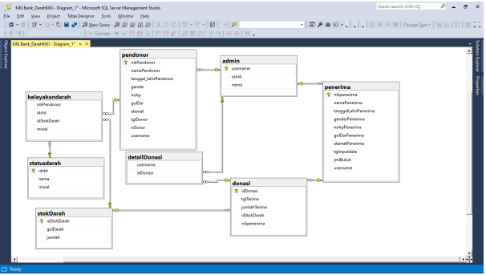

# Portfolio
---

## Dekstop App

### Dekstop App for Blood Bank Management System

<b>Menggunakan Bahasa C#</b> untuk project Blood Bank Management System
   
 

  Database Relation
 

---

### Data Analytics

<b>CXR-ACGAN</b>: Auxiliary Classifier GAN (AC-GAN) for <b>Chest X-Ray</b> (CXR) Images Generation (<b>Pneumonia, COVID-19 and healthy</b> patients) for the purpose of <b>data augmentation</b>. Implemented in TensorFlow, trained on COVIDx CXR-3 dataset.
   
The main objective was to train an <b>Auxiliary Classifier GAN</b> (AC-GAN) to obtain a model for the <b>conditional synthesis</b> of chest radiographs of healthy patients, patients with COVID-19 and patients with non-COVID-19 pneumonia. Additionally, we used the trained GAN to perform <b>data augmentation on the unbalanced COVIDx dataset</b>, generatively balancing minority classes, and possibly improving the performance of some classifiers.

 

 

    
    

© 2022 Carbone Giorgio. Powered by Jekyll and the Minimal Theme.

